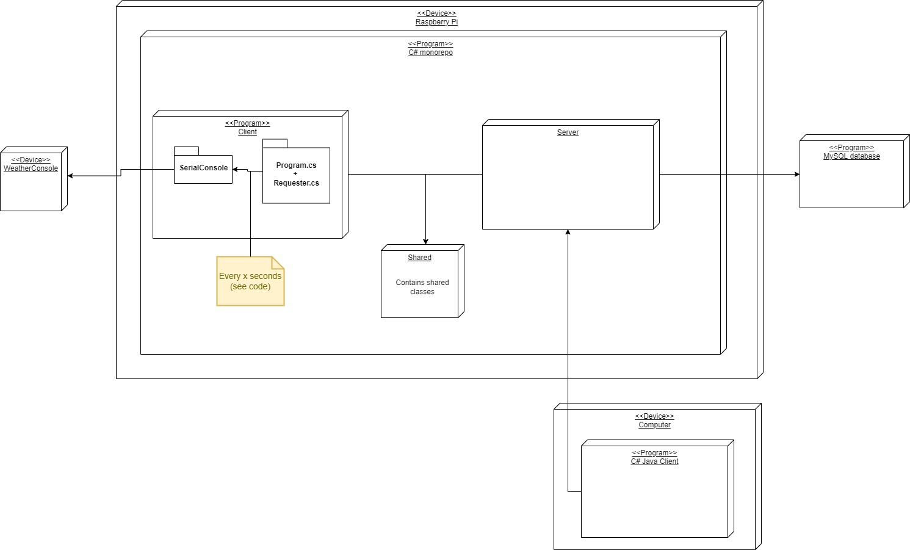

# TI1.1-Weerstation
## Architecture
TiWeatherStation is a C# project that is divided into these parts:

The C# monorepo (the one you are in right now), consists of 3 projects: Client, Server and Shared. Besides this repository there is also the java repository
[//]: # (Add java monorepo link)

The client project is a program that retrieves weatherdata from a weather console via a serial/usb connection.
After it has retrieved the data, it is sent to the server

The server project recieves data from the client and stores it in the MySQL database
The server also has Grpc endpoints that can be used to request the weatherdata

The java client can be used to request weatherdata using various methods.  

## Technology
This project was initially built with .net (core) 6.
Both the client and server program use Grpc and Google's ProtoBuffers to communicate. The .proto file can be found in the "Shared" project.

Docker is used to run both the client and server programs

The java client uses a maven project
# How to run with Docker:

## Run client:
0. Have docker installed.
1. Clone the directory, and change the directory in a docker environment (like WSL).
2. Copy the client.sample.env and add the appropriate values.
3. Run the following command:
```
docker compose up client
OR
docker-compose up client
```
## Run Server:
0. Have docker installed.
1. Clone the directory, and change the directory in a docker environment (like WSL).
2. Copy the server.sample.env and add the appropriate values.
3. Run the following command:
```
docker compose up server
OR
docker-compose up server
```

# Run without docker
As of writing this readme file in Juli of 2022, this project runs .net 6. Thus, you can use the build tools of .net 6 SDK to build this project.
Keep in mind that both the Client and Server project depend on the Shared project.